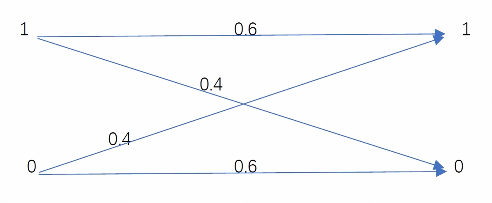

# Chapter 1 Assignment

1. Let $P(x, y)$ be given by

   |$X$/$Y$|0|1|
   |:--|:--|:--|
   |0|1/4|1/2|
   |1|0|1/4|

   Please find
   1. $H(X)$, $H(Y)$
   1. $H(X|Y)$, $H(Y|X)$
   1. $H(X,Y)$
   1. $H(Y)-H(Y|X)$
   1. $I(X,Y)$
   1. Draw a Venn diagram for the above measures in i. through v.

2. Given the binary symmertic channel shown as
   
   We know $P(x=0)=0.3$, $P(x=1)=0.7$, $P(y=1|x=1)=0.6$, $P(y=1|x=0)=0.4$, $P(y=0|x=1)=0.4$, and $P(y=0|x=0)=0.6$. 
   Please determine the mutual information of such channel.

3. Let $X$, $Y$ and $Z$ be joint random variables. Please prove the following inequalities and find conditions for equality.
   1. $H(X,Y|Z)\geq H(X|Z)$
   1. $H(X,Y,Z)-H(X,Y)\leq H(X,Z)-H(X)$
