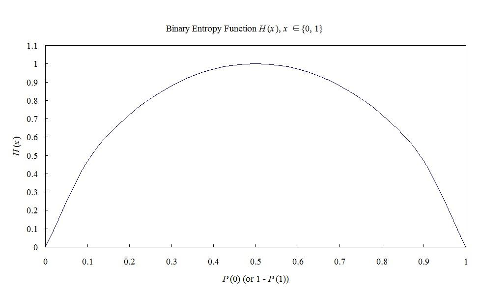

# Entropy and Mutual Information

## An Introduction of Information

The measure of information:
$$
-\sum_{i=1}^{N}P_i\log_2P_i
$$
   - $P_i$: probability of the $i$th possible event
   - $N$: total number of possible events

## Entropy

Measure the amount of information carried by each messsage:
$$
I(M_i)=\log_xP_i^{-1}\quad\begin{cases}
x=2 & I(M_i) \text{ in bits} \\
x=e & I(M_i) \text{ in nats} \\
x=10 & I(M_i) \text{ in Hartley}
\end{cases}
$$
Observations:
   - $I(M_i)\to 0$ if $P_i=1$
   - $I(M_i)\geqslant 0$ when $0\leqslant P_i\leqslant 1$
   - $I(M_i)>I(M_i)$ if $P_i<P_j$
   - Given $M_i$ and $M_j$ are statistically independent,
      $I(M_i\&M_j)=I(M_i)+I(M_j)$

Given a source vector of length $N$, and it has $U$ possible symbols $S_1,S_2,\dotsc S_U$, each of which has probability of $P_1,P_2,\dotsc P_U$ of occurrence.

To represent the source vector, we need
$$
I=\sum_{i=1}^UNP_i\log_2P_i^{-1}\text{ bits.}
$$

On average we need
$$
H=\frac{I}{N}=\sum_{i=1}^UP_i\log_2P_i^{-1}\text{ bits/symbol}
$$
for a source symbol.

$H$ is called the **source entropy**, the average number of information per source symbol

### Binary entropy function:

$$
H = P(0)\log_2P(0)^{-1}+(1-P(0))\log_2(1-P(0))^{-1}
$$

## Mutual Information

## Further Results on Information Theory
