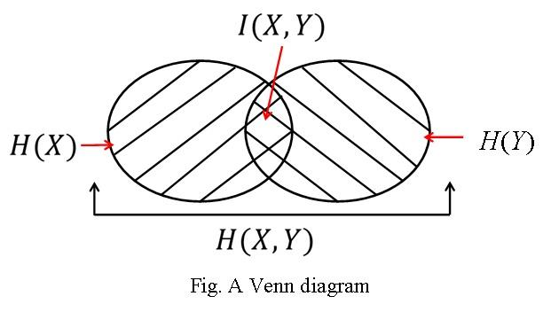

# Entropy and Mutual Information

## An Introduction of Information

The measure of information:

$$
\begin{equation}
-\sum_{i=1}^{N}P_i\log_2P_i
\end{equation}
$$

- $P_i$: probability of the $i$th possible event
- $N$: total number of possible events

## Entropy

Measure the amount of information carried by each messsage:

$$
\begin{equation}
I(M_i)=\log_xP_i^{-1}\quad\begin{cases}
x=2 & I(M_i) \text{ in bits} \\
x=e & I(M_i) \text{ in nats} \\
x=10 & I(M_i) \text{ in Hartley}
\end{cases}
\end{equation}
$$

Observations:

- $I(M_i)\to 0$ if $P_i=1$
- $I(M_i)\geqslant 0$ when $0\leqslant P_i\leqslant 1$
- $I(M_i)>I(M_i)$ if $P_i<P_j$
- Given $M_i$ and $M_j$ are statistically independent,
  $I(M_i\&M_j)=I(M_i)+I(M_j)$

Given a source vector of length $N$, and it has $U$ possible symbols $S_1,S_2,\dotsc S_U$, each of which has probability of $P_1,P_2,\dotsc P_U$ of occurrence.

To represent the source vector, we need

$$
\begin{equation}
I=\sum_{i=1}^UNP_i\log_2P_i^{-1}\text{ bits.}
\end{equation}
$$

On average we need

$$
\begin{equation}
H=\frac{I}{N}=\sum_{i=1}^UP_i\log_2P_i^{-1}\text{ bits/symbol}
\end{equation}
$$

for a source symbol.

$H$ is called the **source entropy**, the average number of information per source symbol

### Binary Entropy Function

$$
\begin{equation}
H = P(0)\log_2P(0)^{-1}+(1-P(0))\log_2(1-P(0))^{-1}
\end{equation}
$$

### Entropy for Two Random Variables

- Two random variables: $X$ and $Y$
- Realizations of $X$ and $Y$ are $x$ and $y$
- Distributions of $X$ and $Y$ are $P(x)$ and $P(y)$

#### Joint Entropy

Given a joint distribution $P(x,y)$:

$$
\begin{equation}
H(X,Y)=-\sum_{x\in X}\sum_{y\in Y}P(x,y)\log_2P(x,y)
\end{equation}
$$

#### Conditional Entropy

$$
\begin{equation}
\begin{split}
H(Y|X) &= \sum_{x\in X}P(x)H(Y|X=x)\\
&= -\sum_{x\in X}\sum_{y\in Y}P(x)P(y|x)\log_2P(y|x) \\
&= -\sum_{x\in X}\sum_{y\in Y}P(x,y)\log_2P(y|x)
\end{split}
\end{equation}
$$

### Chain Rule

Relationship between Joint Entropy and Conditional Entropy:

$$
\begin{equation}
\begin{split}
H(X,Y) &= H(X)+H(Y|X) \\
&= H(Y)+H(X|Y)
\end{split}
\end{equation}
$$

## Mutual Information

- Two random variables $X$ and $Y$
- Realizations of $X$ and $Y$ are $x$ and $y$
- Distributions of $X$ and $Y$ are $P(x)$ and $P(y)$
- Joint distribution of $X$ and $Y$ is $P(x,y)$
- Conditional distribution if $X$ is $P(x|y)$

$$
\begin{equation}
I(X,Y)=\sum_{x\in X}\sum_{y\in Y}P(x,y)\log_2\frac{P(x|y)}{P(x)P(y)}
\end{equation}
$$

Mutual Information's relationship with entropy:

$$
\begin{equation}
I(X,Y)=H(X)+H(Y)-H(X,Y)
\end{equation}
$$

The symmetry of Mutual Information:

$$
\begin{equation}
I(X,Y)=I(Y,X)
\end{equation}
$$

Corollary:

$$
\begin{equation}
\begin{split}
I(X,Y) &= H(X)-H(X|Y) \\
&= H(Y) - H(Y|X)
\end{split}
\end{equation}
$$

Bounds on $I(x,Y)$:

$$
\begin{equation}
0\leq I(X,Y)\leq \min\{H(X),H(Y)\}
\end{equation}
$$

### Mutual Information of A Channel

- Consider $X$ is the transmitted signal, $Y$ is the received signal
- $Y$ is a variant of $X$ where the discripency is introduced by the channel

Mutual Information of the channel, denoted as $I(X,Y)$:

$$
H(X)-H(X|Y)
$$

**Remark**: Mutual Information $I(X,Y)$ describes the amount of information one variable $X$ contains about the other $Y$, or vice versa as in $I(Y,X)$.

## Further Results on Information Theory

### Relative Entropy

- $X$ and $\hat{X}$ are two random variables with realizations of $x$ and $\hat{x}$, respectively
- They aim to describe the same event with the probability mass function of $P(x)$ and $P(\hat{x})$, respectively

$$
\begin{equation}
D(P(x),P(\hat{x}))=\mathbb{E}\left[\log_2\frac{P(x)}{P(\hat{x})}\right]
\end{equation}
$$

Relative Entropy is often called the **Kullback-Leibler distance** between two distributions. It's not symmetric as $D(P(x),P(\hat{x}))\neq D(P(\hat{x}),P(x))$.

Corollary:

- When $P(x)=P(\hat{x})$, $D(P(x),P(\hat{x}))=0$
- $D(P(x),P(\hat{x}))\geq 0$

### Convex Function

### Jensen's Inequality

### Fano's Inequality

### Data Processing Inequality
